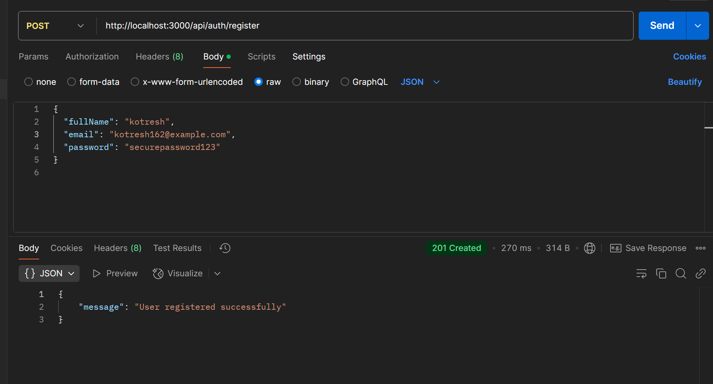
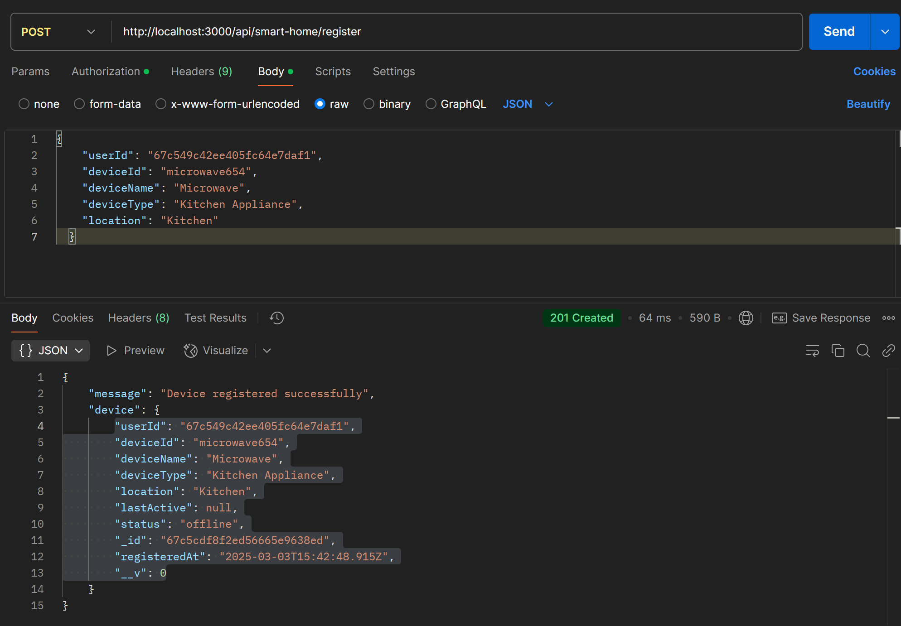
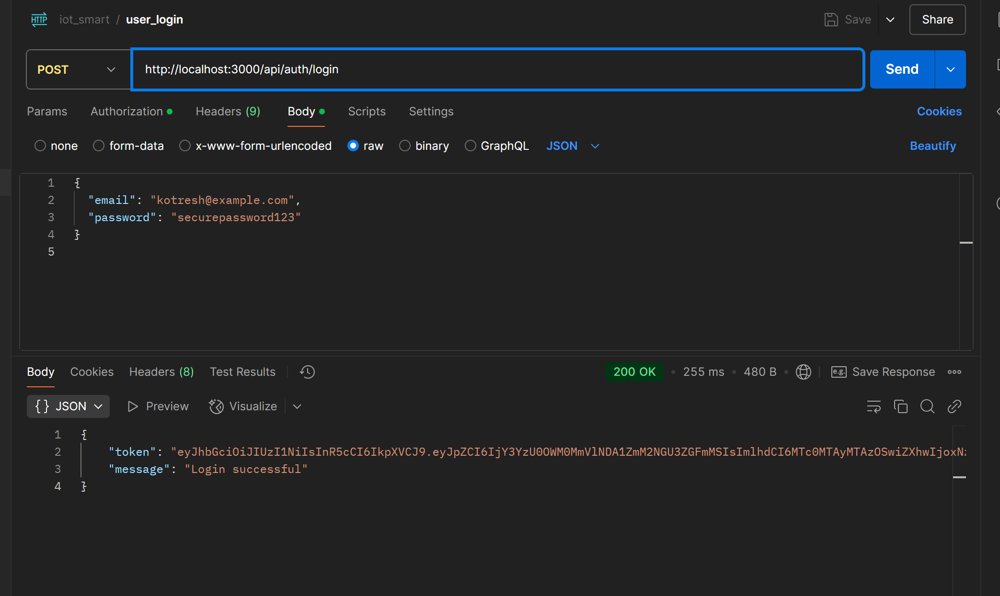

# Smart Home API

## Description
The Smart Home API allows users to register and manage smart home devices, log energy consumption, and set energy budgets.

## Installation
1. Clone the repository:
   ```bash
   git clone <repository-url>
   ```
2. Navigate to the project directory:
   ```bash
   cd smart_home_api
   ```
3. Install dependencies:
   ```bash
   npm install
   ```

## Usage
The API can be used to manage smart home devices and energy consumption. Below are the available endpoints.

## API DATAs format






## API Endpoints

### Authentication
- **POST /api/auth/register**: Register a new user.
- **POST /api/auth/login**: Log in an existing user.

### Energy Management
- **POST /api/energy/log**: Log energy consumption.
- **GET /api/energy/data**: Retrieve energy consumption data.
- **POST /api/energy/budget**: Set energy usage budget.

### Smart Home Device Management
- **GET /api/smart-home/:userId/devices**: Get all devices registered by a user.
- **POST /api/smart-home/register**: Register a new smart home device.
- **POST /api/smart-home/telemetry**: Update device telemetry.

## Models
- **User**: Represents a user in the system.
- **EnergyConsumption**: Represents energy consumption logs.
- **SmartHomeDevice**: Represents smart home devices.
- **EnergyBudget**: Represents energy budgets.

## Technologies Used
- Node.js
- Express
- Mongoose
- JWT for authentication
- Bcrypt for password hashing

## License
This project is licensed under the ISC License.
